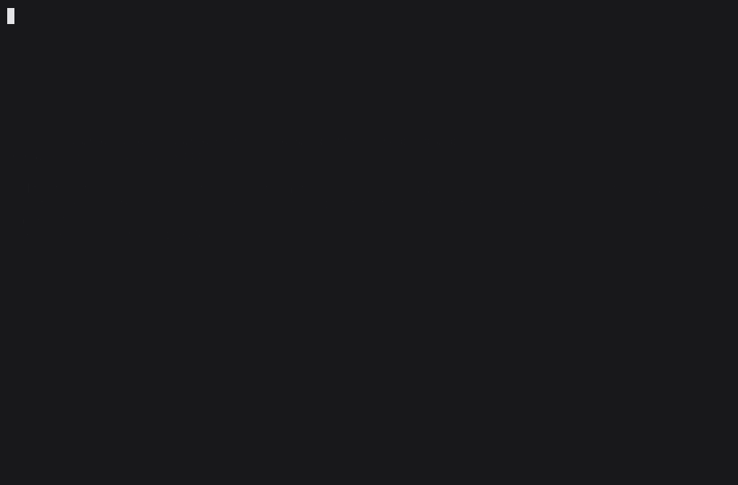

# dazza

> Stop operating your coding agent. Start managing it.

Dazza turns [Claude Code](https://docs.claude.com/en/docs/claude-code) or [Codex](https://github.com/openai/codex) into a contractor you manage, instead of a tool you operate. You describe what you want. Dazza scopes it into a plan you approve, builds it task by task on its own branches, and hands each piece over for review with evidence that it works. It asks before anything risky and only interrupts you when it needs a decision. You can run it from your terminal, a local board, or your phone.

> **Status:** early development, built in public. Expect rough edges, and please file issues.



## What a project looks like

```
› I want a booking app for my dog-walking business

● Nice. A few questions first:
  1. Who books: just clients, or do you assign walkers too?
  …

● Here's what I'll build, before I write it up:
  · Clients request a walk from a link; you approve it and assign a walker
  · Calls I made for you: sign-in by email link, hosted on Render (free tier)
  · Not in this version: payments
  Anything wrong or missing?

› looks right

● Writing up the plan now, a few minutes.
✔ Plan saved · 9 tasks · about 5½ hours of building
  M1 Bookings · Clients can request walks and you approve them
    T1  Project setup · S
    T2  Client sign-up and dogs · M
    …
  Review it at http://localhost:4777 · approve there, here, or with /approve

› looks good, approve it. /build

● Building T1 · Project setup
  on branch dazza/T1-project-setup · usually ~20 minutes · towards M1 Bookings · /stop to stop
  …
● T1 is ready for your review · all 4 criteria met · 6 files changed · 12 checks passed
  /accept T1 to merge it · /changes T1 <what to change> · /try T1 to run it first
```

1. **Scoping is a meeting, not a form.** Dazza reads your code first if there is any, then runs a short scoping meeting. It asks a few plain-language questions at a time, recaps what's settled as it goes, and always asks what goes wrong today. It makes sensible calls on anything you don't care about. It checks the plan can actually work: if other people will use it, that includes where it's hosted. Before writing anything, it plays back what it'll build and the calls it made, so you can correct it in a line instead of after a rewrite.
2. **The plan is a real spec.** It has a scope document (users, flows, data model, what's in and out, decisions, risks, guardrails) and tasks with clear descriptions, subtasks, checkable acceptance criteria and a size. Bigger plans are grouped into milestones, each a stage you can actually try. It all shows on a local board.
3. **Building happens beside you, not over you.** Each task is built in its own git worktree, on its own branch, so your checkout is never touched. Keep working, uncommitted changes and all. Independent tasks build side by side (two at once by default), and each builder leaves notes (conventions, commands, gotchas) for the ones after it.
4. **Built to fit.** In an existing codebase, Dazza plans like an engineer joining the team: it maps how the code is laid out and where the new code goes, follows the patterns already there, and reuses the libraries you use. Every plan also has a security section (who can do what, validation, secrets, the attacks that apply), and every task spells out its edge cases, with criteria that test them.
5. **Every handoff comes with proof.** The builder reports on each acceptance criterion with evidence: the test, the command and what it showed. Work that changes what you see comes with screenshots. Dazza won't accept a handoff that contains secrets, files that shouldn't be committed, or a project template's unused placeholders. You review, `/try` it (Dazza installs and starts it for you), then `/accept` to merge or `/changes` to send it back.
6. **You're only interrupted for real decisions.** Blocked tasks ask one clear question and the build moves on. Answer from anywhere, and it picks the task back up.
7. **Milestones and a close-out.** When a stage is done, Dazza tells you what it delivered. At the end, it writes a report: what was built, what changed along the way, how to run it, and what's next.

## Get started

You need Node 22+ and [Claude Code](https://docs.claude.com/en/docs/claude-code) or [Codex](https://github.com/openai/codex) installed and signed in.

```sh
npm i -g dazza

cd ~/your-project
dazza doctor   # checks everything's ready
dazza          # start talking
```

With pnpm, it's `pnpm add -g dazza`. If pnpm says `ERR_PNPM_NO_GLOBAL_BIN_DIR`, run `pnpm setup` once and open a new terminal.

To run it from source instead: `git clone https://github.com/harrison-bbb/dazza && cd dazza && pnpm install && pnpm build && npm link`.

The first run asks how Dazza should reach the AI, then offers to link Slack or Telegram:

| Connection | Agent | Pays through |
|---|---|---|
| Claude subscription | Claude Code | your Pro or Max plan |
| Anthropic API key | Claude Code | pay as you go |
| ChatGPT subscription | Codex | your Plus or Pro plan |
| OpenAI API key | Codex | pay as you go |

On a subscription, Dazza uses the agent CLI's own sign-in. It strips any API key or other billing setting in your shell from the agent's environment, so billing can't quietly switch.

## Commands

Just type to talk to Dazza, about anything in the project. Type `/` for commands; they're instant and cost nothing. It works like Claude Code: replies stream in, `!npm test` runs a command yourself (Dazza hears how it went), `@src/app.ts` points at a file, Ctrl+V pastes a screenshot, `\` then Enter (or Option+Enter) starts a new line, ↑ recalls earlier messages, and Esc stops a reply.

| The work | |
|---|---|
| `/build` | Build the approved plan, task by task, showing the work as it happens |
| `/stop` | Stop building. The current task picks up where it left off |
| `/status` | Where the project is at |
| `/tasks` | Every task, by milestone, with status and size |
| `/next T7` | Build T7 next (it still waits for what it depends on) |
| `/background on\|off` | Keep building after you close the terminal (off by default). `dazza stop`, or "stop" from your phone, stops it; opening `dazza` takes it back |
| `/parallel 1–3` | How many independent tasks to build at once (default 2) |

| Reviewing | |
|---|---|
| `/review` | Everything waiting on you, and what to do about each |
| `/accept T3` | Approve T3; it merges into your branch |
| `/changes T3 <note>` | Send T3 back with what to change |
| `/try T3` | Run T3's work and open it in your browser, to try it before approving (`/try stop` to stop it) |
| `/diff T3` | What T3 changed, file by file |
| `/allow T3`, `/deny T3` | Answer T3's request to run a command that needs your OK |
| `/redo T3 [note]` | Throw away T3's work and build it again from scratch (asks first) |
| `/cancel T5` | Drop a task (asks you to confirm first) |

| The project | |
|---|---|
| `/approve` | Approve the drafted plan |
| `/dashboard`, `/scope` | Open the board, or the scope document |
| `/report` | A progress report, or the close-out at the end |
| `/new` | Start a fresh conversation. The plan and board stay as they are |
| `/continue` | Pick up the last conversation (`dazza --continue` starts there). Each `dazza` starts a new one |
| `/compact`, `/context` | Summarise the conversation to free up room (Claude Code's or Codex's own compaction); see how full it is |

| Setup | |
|---|---|
| `/model`, `/usage` | Switch models; see your plan's limits or API spend |
| `/mcp [on\|off]` | The MCP servers you have in Claude Code or Codex. Dazza's chat can use them (builders can't) |
| `/notify on\|off` | Desktop notifications when a task needs you (on by default) |
| `/phone-merge on\|off` | Whether approving from Slack or Telegram merges the work. Off keeps merging to the terminal and the board |
| `/slack`, `/telegram` | Connect (or check) Slack or Telegram. `-disconnect` to unlink |
| `/logout`, `/help`, `/exit` | |

The board runs at `http://localhost:4777` while Dazza is open. You can **watch builds live**: the dashboard and each task page show what the builder is doing right now (what it's thinking, the files it touches, the commands it runs), and afterwards the task's build log shows how it was built. The board has the dashboard and milestones, and every task with its handoff, evidence and a comment thread shared with Dazza. The **scope of work** reads like a proper project plan. It has the agreed scope, a deliverables table with every task's acceptance criteria and status (always in step with the tasks), and the change log. You can **edit it right there**: once the plan is approved, your edit goes in the change log as yours, and Dazza and the builder work from the new version. Every version of the scope is kept: view any earlier one and restore it. Restoring adds a version, so nothing is lost. You can also download the scope as Markdown, or print it or save it as a PDF. Tasks can be edited on the board too (title, size, description, criteria). `dazza board` opens the board without starting a chat. The board only answers links that carry its key, which Dazza adds for you (`/dashboard` opens one), so other websites and other people on your network can't read it.

## Safe to point at real work

Dazza's builder works like a careful engineer on someone else's systems. On Claude Code and Codex alike, every command and file access goes through **Dazza's guard** before it runs. The guard is built to refuse some things outright and ask before others. It's a strong safeguard, not a sandbox, and [docs/security.md](docs/security.md) says where it stops.

- **Refused, even if asked:** pushing, deploying or publishing, `sudo`, credential files, anything outside the task's worktree, switching branches, changing cloud or cluster resources.
- **Asks you first:** remote databases, deleting data, sending changes to outside services, machine-wide installs. The builder asks with the exact command and why. You answer with `/allow`, `/deny`, the board, or a button on your phone. Allowing covers that one command for that one task.
- **Just works:** everything else inside the task's worktree.

Before any handoff is committed, Dazza checks it the way a reviewer would: no secrets (live keys, private keys, tokens), no `.env` files, logs or `node_modules`, and nothing enormous. Background processes the builder started (say, a dev server) are stopped when its run ends. Everything the guard stops is logged on the task. [docs/security.md](docs/security.md) has the full rules, and their limits.

## When Dazza gets it wrong

- **Send it back** with what to change (`/changes T3 <note>`): the builder fixes it on the same branch.
- **Start it over** when it's not worth fixing (`/redo T3 <what to do differently>`, or **Start over** on the board): the work is thrown away and the task is built again from scratch.
- **Restore an earlier scope** on the board if an edit went the wrong way.
- Nothing merges until you approve it, so a bad attempt never reaches your branch.

## Plans change

Ask "can we do X instead?", "add Y", or "we don't need T9", and Dazza handles it like a good contractor handles a change request. It proposes first: which tasks it adds, changes or cancels, what already-built work it touches, and what it costs in time. Nothing changes until you say yes, and cancelling always gets a confirm. Then the tasks and the scope document are updated together, and the scope's change log records the new version, what changed, and why. Small edits ("rename T3", "do T7 next") just happen.

## Away from your desk

Dazza builds while it's open and your computer is awake. Turn on `/background` and it keeps building after you close the terminal, until the plan is built, you stop it (`dazza stop` from any terminal, or "stop" from your phone), or nothing has happened for 12 hours. On a Mac it keeps the computer from sleeping while it builds. Open `dazza` in the project again and the build comes back to the terminal.

Link **Slack** or **Telegram** and Dazza reaches you while it builds. It's the same conversation as the terminal.

- **Notifications:** a task ready for review (with screenshots and the criteria results), a blocked task's question, a command waiting for your OK, a milestone reached, a build that stopped, a usage limit.
- **Buttons:** Approve (with a confirm), Request changes, Allow once / Don't allow.
- **Threads:** reply to a notification and Dazza knows which task you mean.
- **Slack extras:** a Home tab with the whole project, and `/dazza status|build|stop` from anywhere. Setup takes about two minutes, with no server; it uses Socket Mode.

Only you are listened to. Messages from anyone else are ignored. Anyone who gets into your Slack or Telegram could approve work from there, though, so `/phone-merge off` keeps merging to your computer: the phone still gets everything else.

## When things go wrong

- **Usage limit reached:** the task pauses and resumes the same session when the limit resets.
- **Out of credit, or a rejected key:** it stops straight away and says what to do.
- **Overloaded service:** it backs off and retries. **The agent CLI crashes:** it retries once, then blocks the task with the error.
- **Dazza is killed** (terminal closed without `/background`, laptop died): the task resumes in its worktree next time.
- **Lost conversation** (Claude Code deletes old sessions): it starts a fresh one, and the plan is unaffected.
- **A stuck builder** (20 minutes of silence): it stops it, explains, and moves on.

## How it works

```
you ──chat, board, phone──▶ dazza (manager session) ──▶ .dazza/ scope, tasks, events
                                │
                                └─ build loop ──▶ claude / codex, headless, one worktree per task
                                                     │  every tool call through Dazza's guard
                                                     └─ handoff ──▶ review ──▶ merge on approval
```

- **No new coding brain.** Dazza orchestrates the agent CLI you already use, with your login.
- **Plain files.** Project state is readable files in `.dazza/`, kept out of git.
- **Typed protocol.** Agents talk to Dazza through its MCP tools, not by parsing prose.

More in [docs/architecture.md](docs/architecture.md), [docs/providers.md](docs/providers.md) and [docs/security.md](docs/security.md).

## Limits

- Dazza builds while it's open, or in the background once you turn on `/background`. Either way your computer needs to be on. Building tasks side by side finishes sooner but uses your plan's limits faster: `/parallel 1` builds one at a time.
- On Codex, Dazza's guard needs a recent Codex CLI (one with hooks). Dazza won't run Codex in a project that brings Codex hooks of its own until you've reviewed them in Codex.
- Task sizes are estimates. They start at about 10, 20 and 40 minutes for S, M and L, then follow how long this project's tasks actually take. The close-out report compares each task's size with its real time.
- Deploying is deliberately yours: Dazza prepares the config and a checklist, and you do the final steps.

## Development

```sh
pnpm install
pnpm check   # lint + typecheck + tests
pnpm build && node dist/cli.js
```

Tests use recorded agent output and fake CLIs, never live model calls. For board work with hot reload, run `dazza board` in a project with a plan, then `pnpm dev:web`. See [CONTRIBUTING.md](CONTRIBUTING.md).

## License

[MIT](LICENSE)
